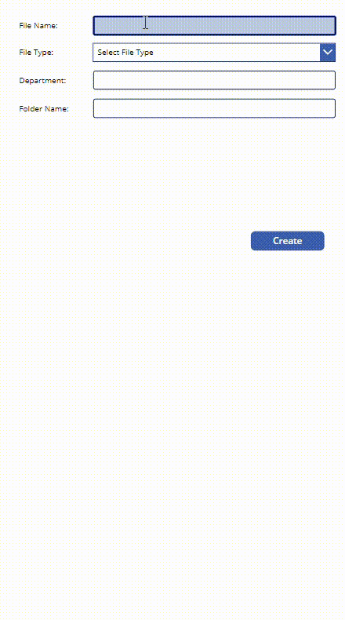

# Invoice Scanner

## Summary
This app takes the detail from end user for the document that has to be created in SharePoint.
In the background, a flow runs to create a document in SharePoint Document library in specific folder.

**Scan Invoice**

**Document Library**

## Contributors 

[Diksha Bhura](https://github.com/Diksha-Bhura)

## Version history

| Version | Date             | Comments        |
| ------- | ---------------- | --------------- |
| 1.0     |July 15 , 2023    | Initial release |
